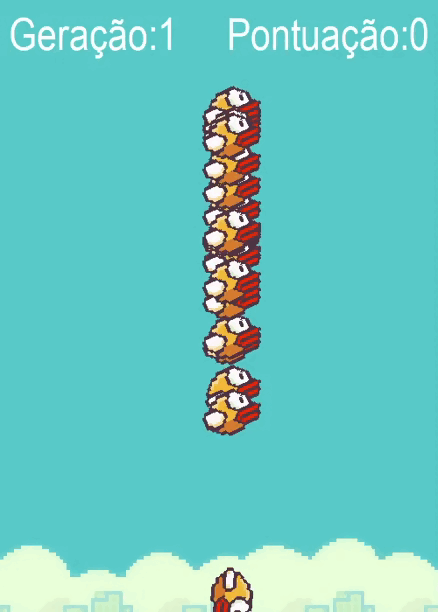

  

# Flappybird e IA
Esse projeto foi desenvolvido para fins de estudos, implementando uma IA para jogar o jogo FlappyBird.

## 🛠 Tecnologias
As seguintes ferramentas foram usadas na construção do projeto:
- [NEAT](https://neat-python.readthedocs.io/en/latest/neat_overview.html)
- [Python](https://www.python.org/)
- [Pygame](https://www.pygame.org/docs/)

## ⚙️ Como rodar o projeto
 * pip install -r requirements.txt 
 * Dentro da sua IDE navegue até a pasta do projeto 
   * \FlappyBird
 * Ative o ambiente virtual: 
    * .\venv\Scripts\activate.ps1 
 * Execute o arquivo do projeto
    * FlappyBird.py
 
